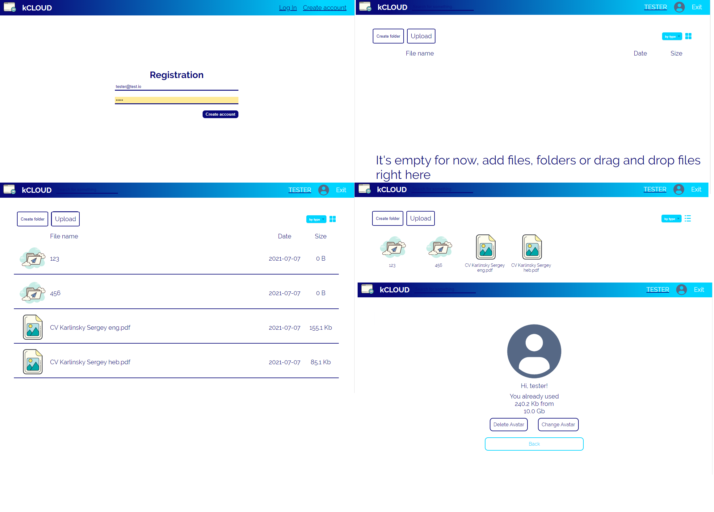

## **Backend for @k-cloud service**

This is an example of cloud service with registration, storage files and folders and avatar editing<br />
Backend part. <br />

Demo is <a href="https://kcloud-react.herokuapp.com" target="_blank">**here**</a>

Frontend code is <a href="https://github.com/ieffai/k-cloud-client" target="_blank">**here**</a>.

### Local Deploy

Install all dependencies, in repo's root:

```
$ npm install
```

- **Used technologies**

  - REST API
  - node.js, express
  - bcrypt, JWT
  - MONGO, mongoose

## 

**For suggestions and errors:**
4923920@gmail.com
